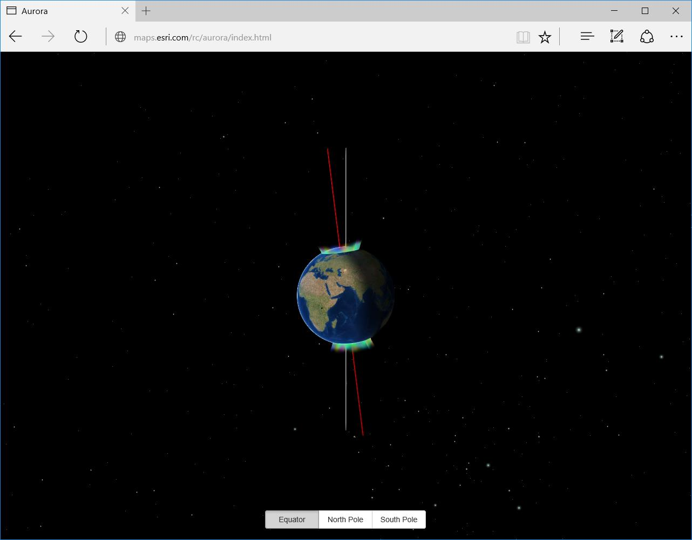
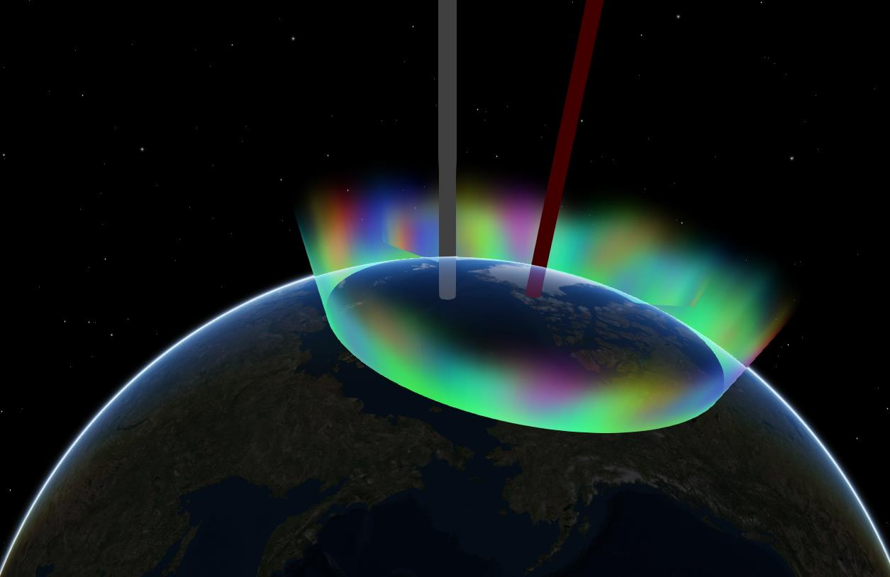

# Earth Magnetic Field
A non-interactive animating globe showing an approximation of the Earth's [aurora](https://en.wikipedia.org/wiki/Aurora).

Click [here](http://richiecarmichael.github.io/aurora/index.html) to view the live application.

### This application makes use of the following libraries
* [ArcGIS API for JavaScript](http://developers.arcgis.com/javascript/) by [Esri](http://www.esri.com)
  - Esri’s JavaScript library for mapping and analysis.
* [Bootstrap](http://getbootstrap.com/) by [Twitter Inc](https://twitter.com/)
  - A useful and comprehensive UI framework. This application leveraged a subset of bootstrap pertaining to buttons and input elements.
* [jQuery](http://jquery.com/) by jQuery Foundataion Inc.
  - A JavaScript framework for DOM manipulation and a foundation for many other frameworks.
* [three.js](http://threejs.org/) by [Ricardo Cabello](https://twitter.com/mrdoob) (aka [Mr.doob](https://github.com/mrdoob))
  - JavaScript 3D library.
### External Renderers
This application is making use of Esri's [external renderer](https://developers.arcgis.com/javascript/latest/api-reference/esri-views-3d-externalRenderers.html) to execute low level [webgl](https://en.wikipedia.org/wiki/WebGL) commands.

